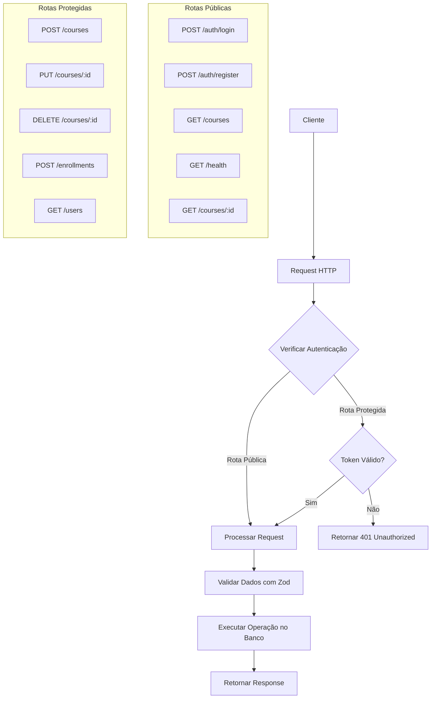
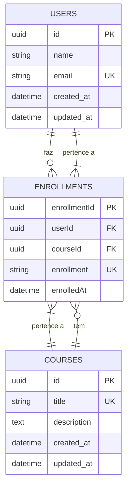

# Fastify TypeScript API – Drizzle ORM & PostgreSQL

API REST moderna construída com Fastify, TypeScript, Drizzle ORM e PostgreSQL.  
Inclui suporte a Docker para desenvolvimento local facilitado.

## Características

- Endpoints com validação Zod
- Drizzle ORM para PostgreSQL  
- Configurações seguras: CORS, rate limiting, helmet
- Docker & Docker Compose para ambiente local

## Começando

### Pré-requisitos

- [Docker](https://www.docker.com/)
- [Node.js](https://nodejs.org/) 

### Desenvolvimento Local

1. **Clone o repositório:**
```sh
git clone https://github.com/seu-usuario/seu-repo.git
cd seu-repo
```

2. **Inicie o PostgreSQL com Docker Compose:**
```sh
docker compose up -d db
```

3. **Configure as variáveis de ambiente:**
Edite o arquivo `.env` conforme necessário:
```
NODE_ENV="development"
DATABASE_URL="postgresql://postgres:postgres@db:5432/postgres"
ALLOWED_ORIGINS="http://127.0.0.1:8080"
```

4. **Instale as dependências:**
```sh
npm install
```

5. **Execute as migrações:**
```sh
npm run db:generate
npm run db:migrate
```

6. **Inicie a API:**
```sh
npm run dev
```

## Fluxo de Rotas e Autenticação



## Diagrama ER do Banco de Dados



## Exemplos de Endpoints

### POST /courses
Criar Curso (Protegido)

Request:
```bash 
curl -X POST "http://localhost:8080/courses" \
  -H "Content-Type: application/json" \
  -H "Authorization: Bearer <seu-token-jwt>" \
  -d '{
    "title": "Node.js Avançado",
    "description": "Aprofunde seus conhecimentos em Node.js"
  }'
```

Response:
```json
{
  "success": true,
  "data": {
    "courseID": "b2c3d4e5-f6g7-8901-bcde-f23456789012"
  }
}
```

### GET /courses?page=1&orderBy=title
Listar Cursos (Público).

Request: 
```curl "http://localhost:8080/courses?page=1&orderBy=title" ```

Response:
```json
{
  "success": true,
  "data": {
    "courses": [
      {
        "id": "a1b2c3d4-e5f6-7890-abcd-ef1234567890",
        "title": "Introdução ao TypeScript",
        "description": "Aprenda os fundamentos do TypeScript",
        "enrollments": 15
      }
    ],
    "total": 1
  }
}
```
### GET /courses?search=typescript&page=1
Buscar Cursos com Filtro (Público).

Request: 
```curl "http://localhost:8080/courses?search=typescript&page=1"```

Response:
```json
{
  "success": true,
  "data": {
    "courses": [
      {
        "id": "a1b2c3d4-e5f6-7890-abcd-ef1234567890",
        "title": "Introdução ao TypeScript",
        "description": "Aprenda os fundamentos do TypeScript",
        "enrollments": 15
      }
    ],
    "total": 1
  }
}
```
### GET /courses/a1b2c3d4-e5f6-7890-abcd-ef1234567890
Obter Curso por ID (Público).

Request: 
```curl "http://localhost:8080/courses/a1b2c3d4-e5f6-7890-abcd-ef1234567890" ```

Response:
```json
{
  "success": true,
  "data": {
    "course": {
      "id": "a1b2c3d4-e5f6-7890-abcd-ef1234567890",
      "title": "Introdução ao TypeScript",
      "description": "Aprenda os fundamentos do TypeScript"
    }
  }
}
```

## Scripts

- `npm run dev` - Inicia API e DB para desenvolvimento
- `npm run db:migrate` - Executa migrações do banco
- `npm run db:seed` - Popula o banco com dados iniciais
- `npm run test` - Executa testes

## Estrutura do Projeto

```
src/
├── db/
│   ├── client.ts        # Cliente Drizzle ORM
│   ├── schema.ts        # Schema do banco de dados
├── routers/
│   ├── courses-route.ts # Rotas de cursos
├── services/
│   └── enrollment.ts    # Geração de números de matrícula
└── server.ts            # Configuração do servidor Fastify
```
