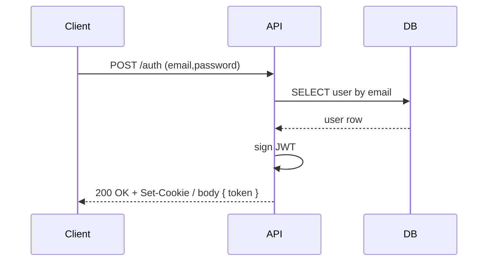

# Fastify TypeScript API (Drizzle ORM & PostgreSQL)

This repository contains a Fastify v5 + TypeScript API using Zod for validation and Drizzle ORM for PostgreSQL. It includes JWT & cookie based auth, middleware, and route plugins organized under `src/routers/`.

Badges
- Package: `api` v1.0.0 (see package.json)
- Status / CI / Coverage: TODO — add your CI badge URLs

---

## Table of Contents

- [Quick Start](#quick-start)
- [Environment](#environment)
- [Project Structure](#project-structure)
- [Running Locally](#running-locally)
- [API Reference (auto-inferred)](#api-reference-auto-inferred)
  - [Examples](#examples)
- [Database](#database)
- [Services / Utilities](#services--utilities)
- [Diagrams (Mermaid)](#diagrams-mermaid)


---

## Quick Start

Prerequisites

- Node.js (recommended: 18+)
- PostgreSQL (can use Docker)
- Recommended dev tools: `npm`, `npx`, `tsx`

Install

```bash
npm install
```

Start DB (using docker-compose provided)

```bash
docker compose up -d db
```

Run in development (example)

```bash
# Uses tsx watch in package.json scripts: start:server / dev
npm run dev
```

Run tests

```bash
# Uses vitest with .env.test loaded via package.json test script
npm test
```

---

## Environment

A generated `.env.example` is provided at the repository root (see `.env.example`). Detected environment variables (inferred from `.env`, `.env.test`, and src/services/env.ts):

| Variable | Description / Usage |
|---|---|
| NODE_ENV | environment (development|production|test) |
| DATABSE_URL / NODE_ENV_DATABASE / DATABSE_URL (typos detected) | Postgres connection string used by Drizzle |
| NODE_ENV_JWT | JWT environment marker (detected) |
| SALT_ROUNDS | bcrypt salt rounds |
| SECRETET_JWT | secret used to sign JWTs |
| CURRENT_COOKIE_SECRETET | cookie signing secret |
| PREVIOUS_COOKIE_SECRETET_1 | previous cookie secret (rotation) |
| PREVIOUS_COOKIE_SECRETET_2 | previous cookie secret (rotation) |
| ALLOWED_ORIGINS | CORS allowed origins |
| ALLOWED_IP | IP allowlist (heuristic) |

See `.env.example` for a ready template. Fill secrets before production.

---

## Project Structure (inferred)

```
src/
├─ api.ts                # exports server (bootstrap)
├─ server.ts             # server listen script
├─ @types/
│  └─ fastify.d.ts       # Fastify custom typings (request.user, etc.)
├─ db/
│  ├─ client.ts          # drizzle client initialization
│  └─ schema.ts          # Drizzle table schema (empty / TODO)
├─ routers/              # Route plugins grouped by domain
│  ├─ auth/
│  │  └─ auth.ts         # authentication routes (login/register)
│  ├─ courses/
│  │  └─ courses-*.ts    # GET/POST/PUT/DELETE routes for courses
│  ├─ teachers/
│  │  └─ teachers-*.ts   # teachers routes
│  ├─ usesr/             # NOTE: folder name 'usesr' (typo?) contains users-* files
│  │  └─ users-*.ts
│  └─ hook/
│     ├─ check-request-jwt.ts
│     └─ check-user-role.ts
├─ services/
│  ├─ env.ts             # env schema parse (zod)
│  ├─ middleware.ts      # global middleware (headers/content-type)
│  ├─ errors.ts          # error mapping plugin
│  ├─ utils.ts           # helpers (hashPassword, etc.)
│  └─ enrollments.ts     # enrollment number generator
```

Notes
- The `usesr` directory name appears to be a typo for `users`. Consider renaming to `users` to avoid confusion.
- `src/db/schema.ts` is present but currently empty — see [Database](#database).

---

## Running Locally (detailed)

1. Start PostgreSQL

```bash
docker compose up -d db
```

2. Create `.env` from `.env.example` and fill secrets.

3. Install dependencies

```bash
npm ci
```

4. Run migrations (drizzle-kit is configured in package.json)

```bash
npm run db:generate   # generate migration (if schema present)
npm run db:migrate
```

5. Start server

```bash
npm run dev
# or
node --env-file .env --watch ./src/server.ts
```

---

## API Reference (auto-inferred)

Notes: the following route summary is inferred from filenames and code structure. Please open the route files under `src/routers/` to confirm exact paths, parameters and schemas. If a route uses dynamic path or complex plugin registration, mark TODO and update.

Detected routes (summary table)

| Area / File | Method(s) | Path (heuristic) | Auth required? | Zod validation? | Notes |
|---|---:|---|---:|---:|---|
| auth/auth.ts | POST | /auth | possibly public | likely Zod (auth payload) | Handles login/register — sets cookie / returns token (heuristic) |
| courses/courses-get.ts | GET | /courses (list) | public | likely query schema | List courses, supports search / pagination |
| courses/courses-post.ts | POST | /courses | protected | likely Zod body | Create course (protected) — sets 201 |
| courses/courses-put.ts | PUT | /courses/:id | protected | likely Zod params+body | Update course |
| courses/courses-delete.ts | DELETE | /courses/:id | protected | | Delete course |
| teachers/* | GET/POST/PUT/DELETE | /teachers | varies | likely Zod | CRUD for teachers |
| usesr/users-post.ts | POST | /users (register) | public | likely Zod body | NOTE: folder name 'usesr' |
| usesr/users-get.ts | GET | /users | protected? | | list users |
| usesr/users-put.ts | PUT | /users/:id | protected | | update user |
| usesr/users-delete.ts | DELETE | /users/:id | protected | | delete user |

Security & auth heuristics:
- Files in `routers/hook/` include `check-request-jwt.ts` and `check-user-role.ts`. These indicate JWT-based auth middleware and role enforcement.
- Custom Fastify types in `src/@types/fastify.d.ts` include `FastifyRequest.user` and `FastifyInstance.authenticate` (decorator) — the server likely decorates an `authenticate` preHandler.

## Examples

Auth (login) — example (heuristic endpoints: adapt to actual route)

```bash
curl -X POST "http://localhost:3000/auth" \
  -H "Content-Type: application/json" \
  -d '{"email":"user@example.com","password":"secret"}'
```

Create course (protected)

```bash
curl -X POST "http://localhost:3000/courses" \
  -H "Content-Type: application/json" \
  -H "Authorization: Bearer <JWT>" \
  -d '{"title":"Node.js Avançado","description":"..."}'
```

Node fetch example

```ts
import fetch from 'node-fetch';
const res = await fetch('http://localhost:3000/auth', {
  method: 'POST',
  headers: { 'Content-Type': 'application/json' },
  body: JSON.stringify({ email: 'a@b.com', password: 'secret' })
});
console.log(await res.json());
```

---

## Database

- Drizzle ORM is used. Client initialization is in `src/db/client.ts`:

```ts
// src/db/client.ts
import { drizzle } from "drizzle-orm/node-postgres";
export const db = drizzle(env.DATABSE_URL);
```

- `src/db/schema.ts` currently appears empty in the repository. Expected tables (based on routes and README examples): `users`, `courses`, `enrollments`. Please add Drizzle table definitions in `src/db/schema.ts`. Example Drizzle snippet (TODO: adapt to your types):

```ts
import { pgTable, serial, text, varchar, timestamp } from 'drizzle-orm/pg-core';

export const users = pgTable('users', {
  id: varchar('id').primaryKey(),
  name: text('name'),
  email: varchar('email').unique(),
  password: text('password'),
  role: text("role").notNull().default("student"),
});
```

Because `schema.ts` is empty, the generator cannot extract columns/constraints automatically. Please fill the schema to enable precise docs.

---

## Services / Utilities

Detected services (under `src/services/`):

- `env.ts` — Zod-based environment parsing (envSchema.parse). IMPORTANT: importing this file may call `envSchema.parse(process.env)` and throw if env is missing. Tests and generators should mock this.
- `middleware.ts` — content-type checks and global middleware registration.
- `errors.ts` — error mapping plugin for the server (map DB errors to HTTP).
- `utils.ts` — helper functions like `hashPassword`.
- `enrollments.ts` — `generateEnrollmentNumber()` helper (example implementation exists).

---

## Diagrams 

Sequence (Login):

