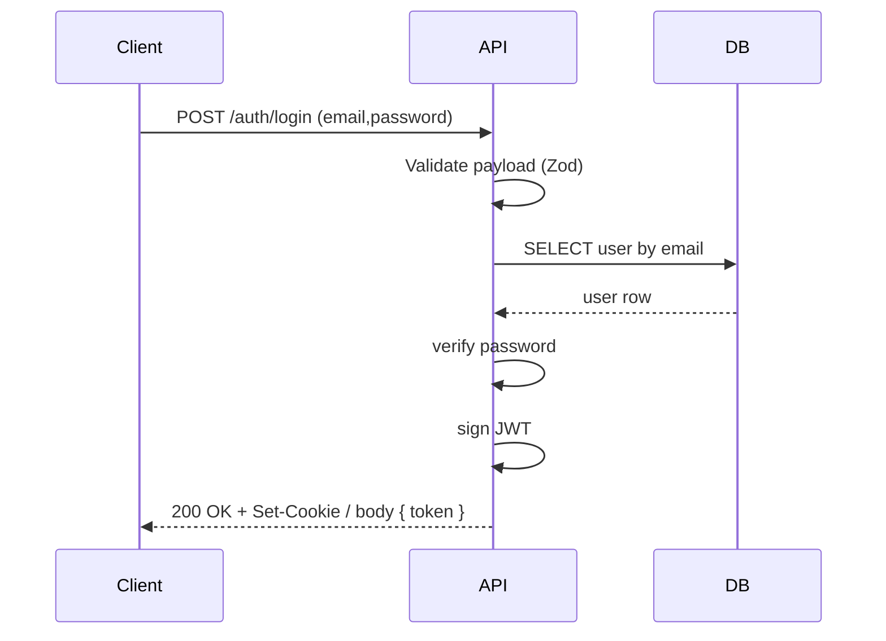
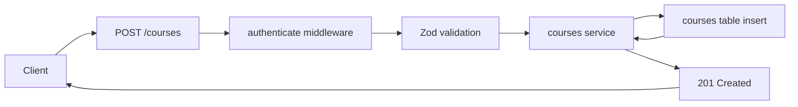

# API Diagrams (Mermaid)

This file contains the main Mermaid diagrams referenced in the README.

## Login Sequence



## Auth Flow (flowchart)

```mermaid
flowchart TD
  U[User] --> A[POST /auth/login]
  A --> B[Validate payload (Zod)]
  B --> C[DB: verify user & password]
  C --> D{Valid?}
  D -- yes --> E[sign JWT & set cookie]
  D -- no --> F[401 Unauthorized]
  E --> U
```

## Component Diagram

```mermaid
graph LR
  Client[Client/browser] --> API[Fastify server]
  API --> Plugins["@fastify/jwt, @fastify/cookie, helmet, cors, rate-limit"]
  API --> Routers["src/routers/* (routes)"]
  Routers --> Services["src/services/* (utils, errors, middleware)"]
  Services --> DB[Postgres (Drizzle ORM)]
  Plugins --> AuthService["JWT handling"]
```

## CRUD Flow Example (POST /courses)

